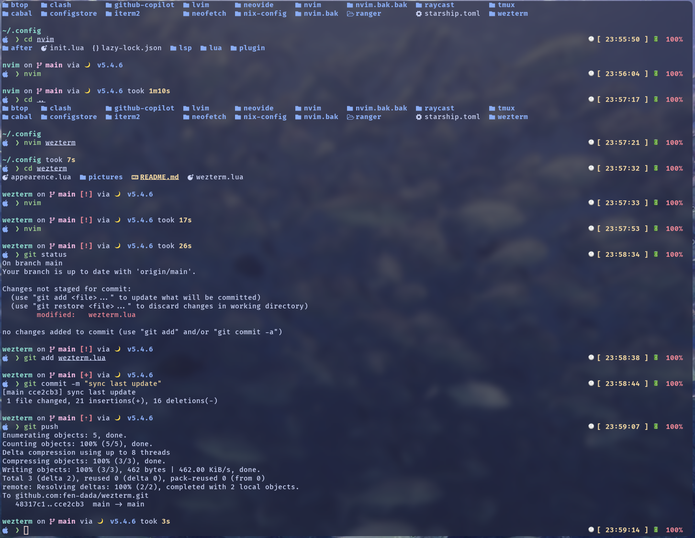

# My Awesome Terminal Setup ✨

[](https://www.zsh.org/)
[](https://wezterm.org/)
[](https://starship.rs/)

A clean and powerful terminal configuration using Zsh, wezterm, and the Starship prompt. This setup is designed for a streamlined and visually appealing command-line experience.



## 📖 Table of Contents

* [🌟 Features](#-features)
* [🛠️ Tech Stack](#️-tech-stack)
* [🚀 Installation](#-installation)
* [⚙️ Configuration](#️-configuration)
* [🎨 Customization](#-customization)
* [🤝 Contributing](#-contributing)
* [🙏 Acknowledgements](#-acknowledgements)

## 🌟 Features

* **Modern Shell:** Powered by Zsh, equipped with useful plugins for autocompletion and syntax highlighting.
* **GPU-Accelerated Terminal:** wezterm is a fast, cross-platform terminal emulator with advanced features like ligatures, panes, and tabs.
* **Informative Prompt:** Starship delivers a minimal, fast, and infinitely customizable prompt that shows you only what you need.
* **Seamless Integration:** All components are configured to work together harmoniously for a fluid workflow.

## 🛠️ Tech Stack

* **Shell:** [Zsh](https://www.zsh.org/)
* **Terminal Emulator:** [wezterm](https://wezterm.org/)
* **Prompt:** [Starship](https://starship.rs/)
* **(Optional) Plugin Manager:** e.g., [Oh My Zsh](https://ohmyz.sh/) or [prezto](https://github.com/sorin-ionescu/prezto)

## 🚀 Installation

Follow these steps to install and set up this configuration.

1.  **Install Zsh:**
    ```shell
    # On macOS (often pre-installed)
    # brew install zsh

    # On Debian/Ubuntu
    sudo apt-get update && sudo apt-get install -y zsh
    ```

2.  **Install wezterm:**
    Follow the instructions on the [wezterm official installation docs](https://wezterm.org/docs/installation.html).

3.  **Install Starship:**
    ```shell
    curl -sS https://starship.rs/install.sh | sh
    ```

4.  **Clone this repository:**
    ```shell
    git clone https://github.com/fen-dada/wezterm.git ~/.config

    # If you prefer my Starship config, then do
    git clone https://github.com/fen-dada/Starship.git ~/.config
    ```
    [My Starship configuration]()

5.  **Apply a new configuration:**
    Restart your wezterm terminal for all changes to take effect.

## ⚙️ Configuration

Here's an explanation of the key configuration files.

* `~/.zshrc`: Contains all Zsh settings, aliases, and loaded plugins.
* `~/.config/wezterm.lua`: Detailed configuration for wezterm, such as color scheme, font, and keybindings.
* `~/.config/starship.toml`: Configuration for the Starship prompt, where you can enable or customize modules.

## 🎨 Customization

You can easily tailor this setup to your own preferences.

* **Changing the Theme:** Modify the `color_scheme` variable in `wezterm.lua` to change the color scheme.
* **Modifying the Prompt:** Edit the `starship.toml` file to add or remove prompt modules. See the [Starship official documentation](https://starship.rs/config/) for a full list of options.
* **Adding Zsh Plugins:** Add the name of the new plugin to the `plugins` array in your `.zshrc`.

## 🤝 Contributing

Contributions of all kinds are welcome! If you have suggestions for improvements, feel free to submit a pull request.

1.  Fork the Project
2.  Create your Feature Branch (`git checkout -b feature/AmazingFeature`)
3.  Commit your Changes (`git commit -m 'Add some AmazingFeature'`)
4.  Push to the Branch (`git push origin feature/AmazingFeature`)
5.  Open a Pull Request


## 🙏 Acknowledgements

* A huge thanks to the developers of Zsh, wezterm, and Starship.
* Thanks to all the dotfiles projects that provided inspiration.

